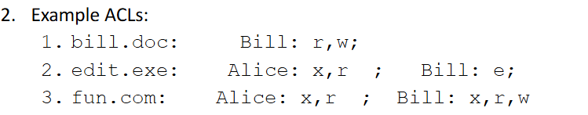
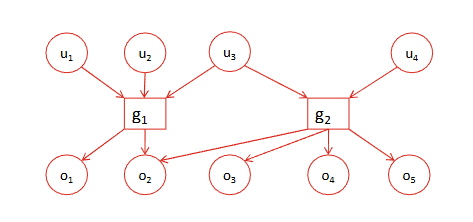

# 🧠 企业访问控制与身份管理 完整学习笔记（2025 修正版）  
**课程**：ABERDEEN 2040 Network Security Technology  
**主题**：Enterprise Access Control, Identity Management & OS-level Access  
**版本**：v2.0（已更正洋葱模型并补充全部细节）

---

## 0. 导语
“访问控制”看似只是“允许/拒绝”，实则贯穿**硬件→OS→服务→应用→用户→网络**全栈。  
本笔记以**课件原文**为骨架，**逐字逐句补全、校正、注解**，确保零遗漏、零错误。

---

## 1. 引言：什么是访问控制
1. 定义：确保**恰好**的代理（agent）在**恰好**的条件（时间、上下文）下访问**恰好**的资源。  
2. 范围：通用信息安全问题，**不仅限于数据**；在计算机安全语境下讨论时，主体=用户/进程，客体=文件/服务/设备。

---

## 2. 基本访问控制模型（The Core Trio）
```
actor ──Request──> guard ──Grant/Deny──> object
```
- **actor**：发起者（人、进程、服务）。  
- **guard**：引用监控器（reference monitor），必为**不可绕过**、**可验证完整性**。  
- **object**：被访问资源（数据、外设、网络端点）。  

---

## 3. 保护域·策略·机制（Protection Domain → Policy → Mechanism）
1. **保护域**：实体与资源的“共处空间”，潜在访问关系在此空间内定义。  
2. **保护目标**：组织想保护什么、防谁、防到什么程度。  
3. **安全策略**：把目标写成**可执行规则**（自然语言→形式语言→机器代码）。  
4. **安全机制**：实现策略的**技术+流程**集合（预防、检测、问责、恢复）。  
   - 访问控制机制只是子集。

---

## 4. 洋葱模型（Onion Model）——**2025 修正描述**
> “保护是通用计算机安全问题，不仅限于数据保护。”

| 层级 | 说明 | 典型访问控制示例 |
|----|------|----------------|
| ⑥ 网络/互联网/Web | 数据在网线上裸奔 | TLS、VPN、零信任、防火墙 |
| ⑤ 硬件 | 物理存储与计算 | TPM、安全启动、UEFI 密码、硬件加密引擎 |
| ④ OS 内核（微内核/Hypervisor） | 仲裁 CPU/内存/中断 | 内核能力空间、SELinux、seccomp、Hypercall 过滤 |
| ③ OS 服务（系统调用层） | 文件系统、进程调度 | POSIX ACL、chmod、chown、namespace |
| ② 中间件&服务 | DBMS、ORB、浏览器本地存储 | SQL GRANT、CORS、SameSite Cookie |
| ① 应用程序 | 用户点击的图标 | RBAC、API Scope、OAuth2 Scope |
| ⓪ 用户 | 点击者本人 | MFA、SSO、生物识别 |

> 每一层都可能被绕过或降级攻击，因此**每一层都要独立设防**。

---

## 5. 认证 vs 授权（Authentication vs Authorization）
- **Authentication**：证明“你是谁”。  
- **Authorization**：决定“你能做什么”。  
本课程重点在**授权**，但需记住二者**必须连续出现**（先 AuthN 后 AuthZ）。

---

## 6. 授权的两阶段生命周期
1. **设置/维护权限**（admin 写策略）。  
2. **使用权限**（guard 查策略并判定）。  
> 注意：文献里“authorization”有时指阶段 1，有时指阶段 2，需按上下文区分。

---

## 7. 可追溯性 & 不可抵赖性 & AAA
- **Accountability**：系统能把动作**唯一追溯**到实体 → 审计日志 + 唯一标识。  
- **Non-repudiation**：实体**事后无法否认**动作 → 数字签名 + 可信时间源。  
- **AAA 框架**：Authentication + Authorization + Accounting（审计）。

---

## 8. 企业身份与访问管理（IAM/IdM）
**集中式平台**一次性完成：
1. 身份生命周期（创建、变更、删除）  
2. 认证（SSO、MFA）  
3. 授权（中央策略库）  
4. 审计（统一日志）  
5. 身份联邦（与其他组织互认身份）

---

## 9. 身份（Identity）概念精要
- 实体（entity）：人、部门、服务账号。  
- 身份（identity）：实体在**某个命名空间**里的名字（user@domain）。  
  - 一对多：一个实体可有多个身份；  
  - 多对一：每个身份只能映射到单一实体。  
- 属性：部门、角色、 clearance、成本中心、资源所有权等。  
  - 多对多：多个身份可共享同一属性。

---

## 10. 主体 & 客体 & 委托人（Subject · Object · Principal）
| 术语 | 定义 | 例子 |
|------|------|------|
| Subject | 系统内**活跃**、能发起请求的实体 | 进程、线程、用户会话、服务账号 |
| Principal | **真正负责**该请求的实体（可被追责） | 用户 ID、服务证书 DN |
| Object | 被访问的**被动**资源 | 文件、DB 表、打印机、内存页 |

> 一个进程（subject）可代表用户（principal）去读文件（object）。

---

## 11. 策略语言（Policy Language）
- 策略必须**形式化**才能被机器执行 → 需要**策略语言**（显式或隐式）。  
- 语言只包含**可判定语义**（Wittgenstein: “Whereof one cannot speak, thereof one must be silent”）。  
  - 例：RBAC 语言 = 用户→角色→权限；  
  - ABAC 语言 = 属性布尔表达式。

---

## 12. 常见访问操作族
- **文件级**：read、write、execute、append、delete、rename、change-owner、change-permissions。  
- **系统级**：fork、kill、debug、ptrace、mount。  
- **网络级**：connect、accept、send、receive、bind。  
> 不同 OS/中间件对同一动词语义可能不同（Windows “Execute” ≠ Linux “x”）。

---

## 13. 增强模型：加入审计与策略库
```
principal ──on behalf of──> subject ──Request──> Reference Monitor
                           │                     │
                           │<--Grant/Deny--------│
                           │                     │
                    Audit Logs <--record-----> Policy Data
```
- **Audit Logs**：用于 accountability。  
- **Policy Data**：独立于代码，可热更新。

---

## 14. 多用户系统的策略由谁设定？
| 模式 | 谁设定 | 能否转让 | 代表标准 |
|------|--------|----------|----------|
| DAC | 资源**所有者** | 可 | Unix chmod、Windows ACL |
| MAC | **系统管理员**统一设定 | 不可 | SELinux、TCSEC Orange Book |

---

## 15. DAC 深度解析
- 前提：系统必须支持“**所有权**”概念（UID、SID）。  
- 授权粒度：通常到**单个用户**或**组**。  
- 生活例子：小孩带锁日记本，钥匙给谁由孩子**自行决定**（need-to-know）。

---

## 16. MAC 深度解析
- 系统-wide 规则，**用户无法更改**。  
- 常用**安全标签**（label）匹配：  
  - 主体 label ≥ 客体 label → 允许读；  
  - 主体 label ≤ 客体 label → 允许写（Bell-LaPadula）。  
- 例子：  
  1. 军队所有**军官**可读**Secret**以上文档；  
  2. 法院可读取司机记录，**车主无权拒绝**。

---

## 17. 权限 vs 权利 vs 条件
- **Permission / Right**：策略数据里的一条记录，表示**允许**某主体对某客体执行某操作。  
- **条件**：时间、位置、设备状态、网络段等**环境属性**（ABAC 核心）。

---

## 18. 时间窗口问题：TOCTTOU
- **Time-of-Check to Time-of-Use**：检查通过到实际使用之间的**竞态窗口**。  
- 攻击例：符号链接替换、文件描述符重定向。  
- 缓解：  
  - 缩短窗口（立即 open() 后 fstat()）；  
  - 加锁（flock）；  
  - 重新验证权限（repeat check）。

---

## 19. 访问关系图 & 访问矩阵
- **图模型**：顶点 = 主体/客体，边 = 操作集。  
- **矩阵模型**：行 = 主体，列 = 客体，单元格 = 操作列表。  
  - 优点：细粒度、直观。  
  - 缺点：稀疏、巨大、更新频繁 → **不直接实现**。

---

## 20. 矩阵的两种间接实现
1. **Capabilities（能力票）**  
   - 按**行**存储：每个主体持一张“票”列表（能访问哪些客体）。  
   - 优点：易委托、易携带（如密钥、JWT）。  
   - 缺点：  
     - 难回收（ revocation ）；  
     - 难审计“谁对某文件有权限”；  
     - 票被盗即全部权限泄露。  

2. **ACL（访问控制列表）**  
   - 按**列**存储：每个客体一张“名单”。  
   - 优点：集中管理、直观符合“保护资产”思维。  
   - 缺点：  
     - 难回收**用户全部权限**（需扫全卷）；  
     - 名单过长时需**抽象机制**（组、角色）。

---

## 21. 组（Groups）
- 定义：** principals 的列表**。  
- 用法：给组授予权限 → 成员自动继承；  
- 生命周期：成员与权限都可**高频变化**；  
- 实现：/etc/group、AD Group、Google Workspace Group。

---

## 22. 角色（Roles）
- 定义：**缓慢的权限集合**，对应**组织职能**。  
- 与组区别：
  - 组 = **用户的集合**；  
  - 角色 = **权限的集合**。  
- 例子：  
  - “HMS Tadpole 值日军官”  
  - “银行代理经理”  
  - “CS1599 课程协调人”  
- RBAC 模型：用户↔角色（多对多），角色↔权限（多对多）。

---

## 23. RBAC 的优势
1. 贴合组织结构，**策略易读懂**；  
2. **权限漂移**少（角色变更频率低）；  
3. 支持**职责分离**（SoD）：互斥角色不能同时授予同一用户；  
4. 合规映射方便（NIST RBAC 标准）。

---

## 24. 能力票意外出现场景（Capabilities by Accident）
- SSL/TLS 客户端证书 → 持有私钥即拥有“票”；  
- 密钥/证书被共享 → 能力票泄露 → **非故意委托**。  
> 提醒：即便你不用“Capabilities”这个词，**密钥、JWT、session cookie** 本质上都是能力票，必须**受保护+可撤销**。

---

## 25. ACL 示例（Unix 风格）
```
bill.doc:    Bill:r,w; Alice:-
edit.exe:    Alice:x,r; Bill:x
fun.com:     Alice:x,r; Bill:x,r,w
```
> 注意：ACL 条目可含**用户名、组名、角色名、SID、UUID**。

---

## 26. 小结：选择 ACL 还是 capabilities？
| 场景 | 首选 |
|------|------|
| 资产为中心（文件、DB、API） | ACL |
| 委托/分布式/高性能 | Capabilities |
| 现代企业系统 | **ACL + RBAC + ABAC 混合** |

---

## 27. 终极记忆口诀
> “洋葱层里藏攻防，DAC MAC 分权忙；  
> 矩阵稀疏拆行列，组快角色稳当当；  
> 认证之后留日志，TOCTTOU 要闭锁。”

---

## 28. 后续学习路线
1. 实现：Linux capabilities、Windows ACL、SELinux RBAC。  
2. 协议：OAuth 2.0、SAML、OpenID Connect、SCIM。  
3. 高级：ABAC、ReBAC、Zero-Trust、Policy-as-Code（OPA/Rego）。

---
